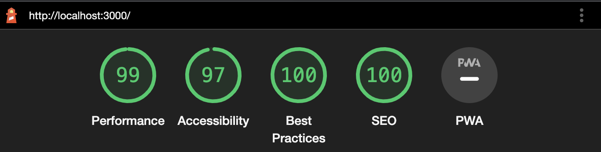

# Next.js Image Gallery Assignment

This is a simple application that uses Next.js, the Unsplash API, and level DB. It includes an authentication page and an image gallery that displays a catalog of images. Users can log in, log out, and like or unlike the images.

## Login Page

### Desktop

### Tablet

### Mobile

## Gallery Page

### Desktop

### Tablet

### Mobile

## Libraries used

- [Next.js](https://nextjs.org/) & [React](https://react.dev/)
- [Next Auth](https://next-auth.js.org/) for authentication
- [https://nextjs.org/](https://next-auth.js.org/) Level Database for storing and fetching user for login
- [Unsplash](https://unsplash.com/developers) API for fetching the images
- [Feather Icons](https://feathericons.com/) for icons
- [React Infinite Scroll Component](https://github.com/ankeetmaini/react-infinite-scroll-component) for infinite scrolling

## Getting Started

### Setup

Before running the project, make sure you create an account and app in [Unsplash](https://unsplash.com/developers).

run `cp .env.sample .env.local` to create a local environment file named .env.local where you'll provide the following secret variables:

- `NEXTAUTH_SECRET`: Generate one using `openssl rand -base64 32`
- `nextAUTH_URL`: The URL used for authentication (http://localhost:3000 for development)
- `NEXT_PUBLIC_UNSPLASH_ACCESS_KEY`: You can find it on your [unsplash App detail](https://unsplash.com/oauth/applications/)

### Running the project

To run the project locally, follow the steps below:

- Clone this repository by running `git clone https://github.com/nouinou/nextjs-image-gallery.git`

#### Development server:

- Run `npm install` to install the necessary packages.
- Run `npm run dev` to serve the project.

Assuming that you have already installed the necessary packages, to serve the project in a production environment, you need to build it first using the npm run build command, and then use npm start to start the server.

- Run `npm run build` to build the project.
- Run `npm start` to serve the project.

#### Production

Once the project is running, open [http://localhost:3000](http://localhost:3000) with your browser to see the result.

## Performance, Accessibility, Best Practices, and SEO Report from Lighthouse

## Learn More

To learn more about Next.js, take a look at the following resources:

- [Next.js Documentation](https://nextjs.org/docs) - learn about Next.js features and API.
- [Learn Next.js](https://nextjs.org/learn) - an interactive Next.js tutorial.

You can check out [the Next.js GitHub repository](https://github.com/vercel/next.js/)

## Deploy on Vercel

The easiest way to deploy a Next.js app is to use the [Vercel Platform](https://vercel.com/new?utm_medium=default-template&filter=next.js&utm_source=create-next-app&utm_campaign=create-next-app-readme) from the creators of Next.js.

Visit the [Next.js deployment documentation](https://nextjs.org/docs/deployment) for more details.
